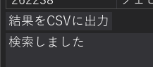

# 類音検索ツール（Sound-Alike Search）使い方

## ⚠️【注意】
**本ツールは格納パスが英数字のみ受け付ける状態になっています。**   
**CJKV文字やその他マルチバイトの文字列のディレクトリには展開しないでください。** 
**また、本ツールで出力されたいかなるファイルも現時点ではUniDicのライセンスにかかるもののため、再配布は禁止されています。** 

---

## 展開直後の構造

アーカイブは展開直後、以下のようになっています。  
  

---

## 初回起動（失敗）

1. `run_sa_search.bat` をダブルクリック  
2. データベースが存在しない状態のため、起動に失敗します。  

---

## 初回起動（事前準備あり）

1. UniDicから辞書アーカイブを入手して、**lex*.csv** を `resource/` に格納してください。 

2. `run_sa_search.bat` をダブルクリック 

3. データベースが作成され、GUIが起動します。 

---

## DBセットアップ後の起動
DBのセットアップが終わった状態になった後は、実行モジュールを直接ダブルクリックで起動してかまいません。 

---

## 瀬戸フォントの適用
検索した文字によっては、フォントが対応しておらずGUI上で？が表示される可能性があります。 
対応範囲の広いフォントとしtえ、本ツールは瀬戸フォントでの描画に対応しています。 

1. 瀬戸フォントのアーカイブファイルを「窓の杜」などから入手し、そのまま `resource/` に格納してください。 

2. `run_sa_search.bat` をダブルクリックすると、フォントのインストール確認が表示されます。`y` を押して進んでください。 

3. フォントファイルが `resource/` に展開され、以後GUIでは当該フォントが利用されるようになります。 

---

## 検索
1. GUIの左上にあるエディットボックスに　かな　又は　カナ　で検索したい文字列を入力してください。 

2. エディットボックスの右にある「検索」ボタンをクリック。 

3. 少しののち、画面中段領域に類音と判定された情報のリストが表示されます。 

エディットボックスの下にあるコンボボックスは、結果に表示されている「品詞」を検索時に絞り込む設定です。 
コンボボックスの下にあるチェックボックスは、検索時に「前方一致（検索した文字列に該当するものが登録文字列の先頭に合致する）」で検索を行う設定にするためのものです。 

---

## CSV出力
検索結果は膨大な場合があるため、CSVファイルに出力できるようになっています。 

1. 検索後、検索結果リストの下にある「結果をCSVに出力」ボタンを押下してください。 

出力処理が始まり、プログレスバーが表示されます。 

2. CSV出力が終わるとプログレスバーが非表示になり、どこに出力されたか、ログ表示されます。 

